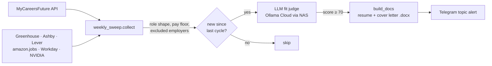

# job-hunter

A self-hosted job-search agent that runs 24/7 on a home NAS. It sweeps Singapore job boards and company
career pages, uses an LLM to judge each new posting against my current role, drafts a tailored resume and
cover letter for the ones that fit, and pings me on Telegram. **It never applies to anything.** A human reads
every draft and decides.



## How it works

| Stage | File | Notes |
|---|---|---|
| Sweep | `build/weekly_sweep.py`, `build/job_sources.py` | MyCareersFuture public API (the only source that publishes a salary band + minimum years), plus ATS boards for employers whose infra roles never reach job boards. Regex filters for role shape, seniority, public-sector work and excluded employers. |
| Judge | `build/nas_agent.py` | Fetches the job description and asks the model for a structured JSON verdict: suitable, 0–100 fit, reason, honest gaps, coding-test risk, and the tailored text. Project picks are validated against the real project library, so the model can't invent one. |
| Draft | `build/build_docs.py` | ATS-plain `.docx` (single column, no tables or text boxes, real bullet lists) from one Python source of truth. |
| Alert | `build/nas_agent.py` | Telegram Bot API, posted to a forum topic. |

State lives in `build/.nas_state.json`. The first run only records a baseline, so it doesn't flood you with every live posting.

## Design decisions

- **The LLM runs through the NAS's existing signed-in Ollama container.** The watcher joins that project's Docker
  network and calls `http://trading-ollama:11434`, so the Ollama Cloud key is never copied into a second place.
- **`think: false` on every call.** With `format: json`, reasoning models otherwise spend the reply on thinking
  and return empty content. I found this while testing against a local `qwen3.6`.
- **Spend is capped** with `MAX_PER_CYCLE`. Postings over the cap stay unseen and roll into the next cycle.
- **Personal data stays out of git.** Resume content (`content.py`) and filters (`my_profile.py`) are gitignored,
  with `*_example.py` stand-ins. `.gitignore` is a whitelist, so a new file is private until someone deliberately publishes it.
- **Self-test before trusting a sweep.** `build/selftest.py` checks filter behaviour and scans for control characters.
  A `\b` flattened into a literal backspace by a shell heredoc once produced a filter that silently matched nothing.

## Run it

```bash
pip install python-docx
cp build/content_example.py build/content.py        # your resume
cp build/my_profile_example.py build/my_profile.py  # your pay floor + excluded employers
python build/selftest.py
python build/nas_agent.py --once                    # one cycle; omit --once to loop
```

Environment: `OLLAMA_BASE_URL`, `JOB_MODEL` (default `deepseek-v4.1-flash:cloud`), `TELEGRAM_BOT_TOKEN`,
`TELEGRAM_CHAT_ID`, `TELEGRAM_THREAD_ID`, `SWEEP_INTERVAL_HOURS` (6), `MAX_PER_CYCLE` (8), `FIT_THRESHOLD` (70).

### On a NAS (Docker)

`deploy/nas/compose.yaml` runs it on `python:3.12-slim` with the project folder mounted. Put `compose.yaml`, `.env` and
`build/` in the share and create the project. It expects an Ollama container on an external network. Change
`networks.desk.name` and `OLLAMA_BASE_URL` to match your own setup.

## Not covered

LinkedIn, Glassdoor, NodeFlair and JobStreet sit behind logins or bot checks. This project doesn't try to get
around them; those stay a manual pass.
