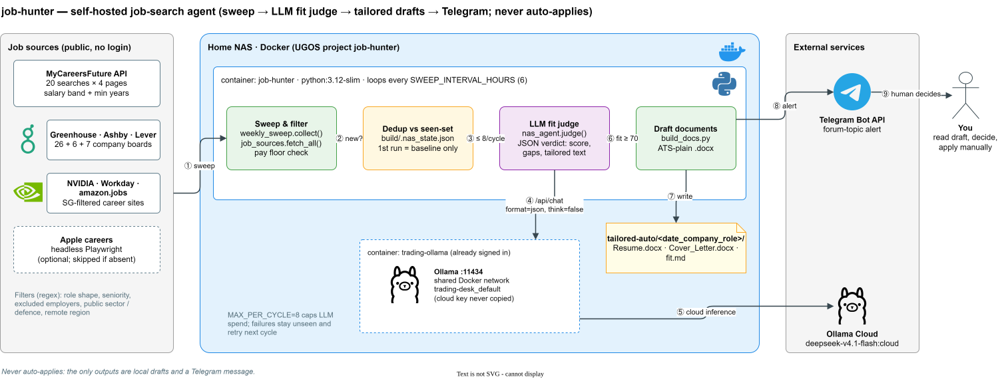
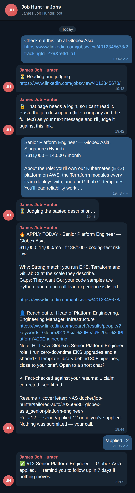
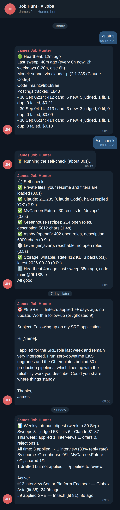

# job-hunter

A job-search agent that runs 24/7 on my home NAS. It sweeps Singapore job boards and company career pages, has an LLM judge how well each new posting fits, drafts a tailored resume and cover letter for the good matches, and sends me a Telegram alert. **It never applies to anything.** I read every draft and decide myself.


-D97757?logo=anthropic&logoColor=white)




<sub>Editable source: [`docs/architecture.drawio`](docs/architecture.drawio) · PNG fallback: [`docs/architecture.png`](docs/architecture.png)</sub>

## Why this exists

The infra roles I want are scattered. Some are on MyCareersFuture. Others appear only on company ATS boards (Greenhouse, Ashby, Lever, Workday) and never reach a job board. Checking all of them by hand every few days is slow, and it's easy to miss a posting. Auto-apply bots have the opposite problem: they send low-quality applications without asking you. This project does the tedious part (finding, filtering, ranking, drafting) and leaves the decision to apply with a person.

## Highlights

- **The human stays in control, by design.** The agent can only write local `.docx` drafts and send one Telegram message. No code path submits an application. Every alert ends with "Nothing was submitted — your call." (`build/nas_agent.py`)
- **The LLM can only pick from real data.** The verdict is enforced by `claude -p --json-schema`, and the schema's project list is an `enum` of the real project library, re-checked in code (`judge()` in `build/nas_agent.py`). The prompt also forbids inventing employers, numbers, certifications or years.
- **Deterministic filters run before the LLM.** Regexes cut role shape, seniority, pay floor, excluded employers and public-sector/defence work before a single token is spent (`build/weekly_sweep.py`). The model only sees candidates that already pass. That keeps cost down and makes the hard rules auditable.
- **Cost is capped and nothing gets lost.** `MAX_PER_CYCLE` (default 8) limits LLM calls per cycle. Postings over the cap, and any whose judge call fails, stay *unseen* and are retried next cycle rather than dropped. The first run only records a baseline, so turning it on doesn't flood you with every live posting.
- **Coverage beyond scraping, without scraping.** LinkedIn, JobStreet, Glassdoor and Indeed stay login-walled to a crawler. Share a job from their app to the bot and it's judged like any other posting; when the page is login-walled, the bot asks you to paste the description and judges your next message against that link. Optionally, with `IMAP_*` set, the watcher also reads their alert emails read-only (`BODY.PEEK`, nothing marked read), has a cheap model (`EXTRACT_MODEL`, default `haiku`) list the postings in each, and runs them through the same regex filters and judge (`build/mail_alerts.py`).
- **Built to get a reply, not just a draft.** Each fit comes with who to contact (likely hiring-manager titles plus a LinkedIn people-search link) and a ≤280-character connection note, also saved as `outreach.md`. Scores ≥ `URGENT_SCORE` are flagged "🔥 APPLY TODAY", and sweeps run every `SWEEP_INTERVAL_HOURS` (1h) round the clock, so a new fit reaches you within the hour, day or night.
- **Outcomes close the loop.** Every fit gets a ref number. `/jobapplied 12`, `/jobinterview 12`, `/jobrejected 12`… record what happened; `FOLLOWUP_DAYS` after `/jobapplied` with no update you get a nudge with a drafted follow-up email; `/jobinterview` builds a prep pack; a Sunday digest reports reply rate by source and whether `FIT_THRESHOLD` looks miscalibrated.
- **Every draft is fact-checked.** Before a fit is drafted, a second `claude -p` pass compares the tagline, summary, cover letter and outreach note with the resume and removes any claim it doesn't support (a wrong year, tool, certification or employer). The alert says how many claims it corrected and `fit.md` lists them; if the check itself fails, the alert says the draft is unchecked (`FACTCHECK=0` turns it off).
- **Judged on the real job description where one exists.** MyCareersFuture via its API, Greenhouse via its per-job endpoint, and Ashby and Lever from the description their board API already returns. Only Apple and alert-email postings are judged on title, company and whatever snippet came with them.
- **One role, one alert.** The same job on MyCareersFuture, a LinkedIn alert and the company's own board is recognised by a normalised company + title fingerprint (legal suffixes, "Singapore", punctuation and case removed) and judged once.
- **The model can read, not act.** Every `claude -p` call runs with `--tools ""`, `--strict-mcp-config`, `--setting-sources ""` and an empty temp directory as its working directory. A job posting that tries prompt injection has no tools and no project files (or `.env`) within reach.
- **Failures are classified.** A CLI, auth, rate-limit or network failure (`ClaudeError`) is transient and retried next cycle forever. A reply without a valid structured verdict counts toward `MAX_ATTEMPTS`.
- **The self-test checks behaviour, not syntax.** A `\b` written through a shell heredoc once collapsed into a literal backspace byte, and a filter silently matched nothing. `build/selftest.py` asserts 14 filter behaviours and scans the source for any C0 control character.
- **Personal data stays out of git by default.** `.gitignore` is a *whitelist*: resume content (`content.py`), personal filters (`my_profile.py`), state, `.env` and generated documents are private unless someone deliberately publishes them. Example stand-ins (`*_example.py`) keep the repo runnable.

## What it looks like in Telegram

<table><tr>
<td width="50%"></td>
<td width="50%"></td>
</tr><tr>
<td>Share a job → paste the description if it's login-walled → alert with fit, gaps, who to contact, fact-check and drafts → <code>/jobapplied 12</code>.</td>
<td><code>/jobstatus</code>, <code>/jobselfcheck</code>, the follow-up nudge 7 days after applying, and the Sunday digest.</td>
</tr></table>

<sub>Rendered from the bot's real message code with sample data.</sub>

## How it works

Numbers match the diagram.

1. **Sweep.** `weekly_sweep.collect()` queries the MyCareersFuture public API (20 search terms × 4 pages). It's the only source that publishes a salary band and a minimum-years figure. `job_sources.fetch_all()` adds company boards: 26 Greenhouse, 6 Ashby, 7 Lever, plus amazon.jobs, Workday tenants, NVIDIA's Workday site (Singapore facet) and, optionally, Apple via headless Playwright. The regex filters and the pay floor are applied here.
2. **Dedup.** Each posting's ID is checked against `build/.nas_state.json`. Only IDs not seen before continue.
3. **Cap.** At most `MAX_PER_CYCLE` new postings go to the model.
4. **Judge.** `judge()` uses the full job description where the source has one (MyCareersFuture, Greenhouse, Ashby, Lever; the rest are judged on title, company and any snippet) and calls `claude -p --output-format json --json-schema <verdict schema>`. The verdict covers: suitable, 0–100 score, reason, honest gaps, coding-test risk, tagline, summary, project picks, cover-letter paragraphs, who to contact and an outreach note. A second pass fact-checks the drafts against the resume.
5. **Inference.** The Claude Code CLI in the container calls Claude (default `sonnet`), authenticated with `CLAUDE_CODE_OAUTH_TOKEN` from `claude setup-token` (subscription) or `ANTHROPIC_API_KEY`. Each run records its `total_cost_usd`.
6. **Gate.** The posting has to be `suitable`, score ≥ `FIT_THRESHOLD` (70), and come with a letter.
7. **Draft.** `build_docs.py` renders an ATS-plain resume and cover letter plus a `fit.md` into `tailored-auto/<date_company_role>/`.
8. **Alert.** One Telegram message goes to a forum topic with the role, pay, score, reasons, gaps, URL, who to reach out to with a drafted note, the path to the draft folder and a ref number.
9. **Human decides.** You apply (or not) and record it with `/jobapplied <ref>`; follow-up nudges, prep packs and the weekly digest build on that. Nothing is ever sent or submitted for you.

Job-alert emails (when `IMAP_*` is set) join the candidate list at step 1 and go through the same steps 2–9.

## Tech stack

| Layer | Tech |
|---|---|
| Language | Python 3.12, stdlib `urllib` (no HTTP client dependency) |
| Documents | `python-docx`: single-column, no tables or text boxes, real bullet lists (ATS-friendly) |
| LLM | Claude via the Claude Code CLI (`claude -p`, `--json-schema` structured output, tools disabled) |
| Sources | MyCareersFuture API, Greenhouse / Ashby / Lever / Workday JSON endpoints, amazon.jobs, Playwright (Apple, optional) |
| Alerts | Telegram Bot API (forum topics via `message_thread_id`) |
| Runtime | Docker Compose on a home NAS (`python:3.12-slim-bookworm` + Node 22 + `@anthropic-ai/claude-code`, `restart: unless-stopped`) |
| State | JSON file (`build/.nas_state.json`) |

## Getting started

```bash
pip install python-docx
npm install -g @anthropic-ai/claude-code             # then `claude` once to sign in, or set CLAUDE_CODE_OAUTH_TOKEN
cp build/content_example.py build/content.py        # your resume (gitignored)
cp build/my_profile_example.py build/my_profile.py  # pay floor + excluded employers (gitignored)
python build/selftest.py
python build/nas_agent.py --once                    # one cycle; omit --once to loop
```

Environment (put the secrets in `.env`, which is never committed):

| Variable | Default | Purpose |
|---|---|---|
| `CLAUDE_CODE_OAUTH_TOKEN` | — | Claude login for the container (`claude setup-token`); or set `ANTHROPIC_API_KEY` |
| `JOB_MODEL` | `opus` | Any `claude --model` value (`haiku`, `sonnet`, `opus` or a full model ID) |
| `FALLBACK_MODEL` | `sonnet` | One retry on this model when a `JOB_MODEL` call fails (rate limit, overloaded) |
| `CLAUDE_BIN` | `claude` | Path to the CLI |
| `CLAUDE_TIMEOUT` | `300` | Seconds per `claude -p` call |
| `TELEGRAM_BOT_TOKEN` | — | Bot token (if unset, alerts are printed to stdout instead) |
| `TELEGRAM_CHAT_ID` | — | Target chat |
| `TELEGRAM_THREAD_ID` | — | Optional forum topic. When set, the bot posts there and answers only messages in that topic (a shared group's other topics belong to other bots) |
| `SWEEP_INTERVAL_HOURS` | `1` | Loop interval, every hour of every day (no quiet hours) |
| `URGENT_SCORE` | `85` | Alerts at or above this say "🔥 APPLY TODAY" |
| `FOLLOWUP_DAYS` | `7` | Days after `/jobapplied` before a follow-up nudge |
| `DIGEST_WEEKDAY` | `6` | Day for the weekly digest (Monday=0, Sunday=6), after 09:00 |
| `EXTRACT_MODEL` | `haiku` | Model that lists the jobs in an alert email |
| `IMAP_USER` / `IMAP_PASSWORD` | — | Optional. Mailbox holding your job alerts; for Gmail use an [app password](https://myaccount.google.com/apppasswords) |
| `IMAP_HOST` / `IMAP_FOLDER` | `imap.gmail.com` / `INBOX` | Where to look |
| `MAIL_FROM` | LinkedIn, JobStreet, Glassdoor, Indeed senders | Comma-separated sender substrings to read |
| `MAIL_DAYS` | `3` | How far back to look each sweep |
| `MAX_PER_CYCLE` | `8` | Max LLM judgements per cycle |
| `FIT_THRESHOLD` | `70` | Minimum score before drafting and alerting |
| `HEARTBEAT_MIN` | `30` | How often the idle loop rewrites the heartbeat in the state file |
| `MAX_ATTEMPTS` | `3` | Cycles a posting may fail with unparseable model output before it's given up |
| `SEEN_DAYS` | `180` | Postings older than this are forgotten, keeping the state file small (tracked applications are kept) |
| `FACTCHECK` | `1` | `0` skips the second pass that checks each draft's claims against the resume |
| `BACKUP_DAYS` | `30` | Daily copies of the state file kept in `build/backups/` |
| `STALL_MIN` | `120` | Minutes without loop progress before the process restarts itself |
| `HEAL` | `1` | `0` turns off the `claude -p` self-repair step |
| `HEAL_MAX_PER_DAY` | `6` | Cap on self-repair diagnoses per day |
| `VAULT_DIR` | unset (compose: `/vault`) | Obsidian vault the agent writes and reads back as memory (see below); unset turns it off |
| `VAULT_UID` | `1000` | Owner given to vault files when the container runs as root, so you can edit them |

### Telegram commands

Between cycles the agent long-polls the bot and answers messages from `TELEGRAM_CHAT_ID` only:

Commands are prefixed `/job` so they never collide with other bots in a shared group; inside the job topic the old short names (`/status`, `/ask`, `/help`, …) still work as aliases. Messages from other topics are ignored, and on a first start (no stored offset) the queued backlog is skipped rather than replayed.

| Command | What it does |
|---|---|
| `/jobstatus` | Heartbeat, last cycle, `claude` CLI version, last 5 runs with cost, last error. No LLM call. |
| `/jobask <question>` | Asks the model, with the recently judged postings, recent drafts, system status and the vault memory (notes on companies you name) as context. |
| `/jobjudge <url> [pasted text]` | Judges one posting on demand and drafts the resume + cover letter if it fits. MyCareersFuture links are read through the API; for login-walled boards (LinkedIn etc.) paste the job description after the URL. |
| `/jobapplied`, `/jobinterview`, `/joboffer`, `/jobrejected`, `/jobghosted` `<ref or text>` | Records an outcome for the alert with that ref, or for "Role at Company" you found elsewhere. `/jobinterview` also replies with an interview prep pack (saved as `prep.md`). |
| `/jobpipeline` | Every tracked application and its status. |
| `/jobselfcheck` | Tries every live dependency for real (private files loaded, Claude login, MyCareersFuture, one Greenhouse / Ashby / Lever board incl. a description fetch, the mailbox, storage and backups) and reports ✅ / ❌ / ⚪ with the reason. Also `python build/nas_agent.py --selfcheck`, which `update.sh` runs after every deploy. |
| *a job link* | Sharing a link (LinkedIn / JobStreet app → Share → Telegram, or just pasting it) is the same as `/jobjudge`. If the page needs a login, the bot says so and judges the description you paste next (within 2h). In a group, turn the bot's privacy mode off (BotFather → `/setprivacy` → Disable) so it can see plain messages; with privacy mode on it only sees commands and replies to its own messages. |
| `/jobheal [what's wrong]` | Runs the self-repair step on the last recorded error (or on your description) and reports the diagnosis and what it did. |
| `/jobsweep` | Runs a cycle now. |
| `/jobhelp` | Lists the commands. |

Only one process may call `getUpdates` per bot token, so nothing else should poll this bot.

### Vault: movement log + memory

With `VAULT_DIR` set (compose mounts `/volume1/James/Obsidian/Job Hunter` at `/vault`), `build/vault.py` keeps an Obsidian vault:
`Home.md` (the pipeline at a glance), `Activity/YYYY/MM/YYYY-MM-DD.md` (one line per event, SGT: `- HH:MM emoji **what** · detail · [[entity]]` for sweeps, fit alerts, not-a-fits, outcomes, commands, self-heal), `Jobs/Company — Title.md` (fit, why, gaps, link, status in frontmatter, append-only `## History`) and `Companies/Company.md` (its postings and outcomes).

It is read back as memory: the judge and `/jobask` prompts get a capped excerpt (about 4,000 chars: the job and company notes, then the recent log, newest first), so the model knows you already applied, were rejected or were ghosted; and a posting whose note shows it was already alerted or acted on is never judged or alerted again, even after the state file forgets it. Vault I/O is best-effort and never breaks a run or costs an alert. No secrets or prompts are written; files are mode 664, owned by `VAULT_UID`.

### Health

Every cycle, including one with nothing new, writes `last_cycle` and a `runs` entry to `build/.nas_state.json`. The idle loop also refreshes `heartbeat` every `HEARTBEAT_MIN` minutes, and the compose healthcheck marks the container unhealthy once that stamp is over 2h old. If every judge call in a cycle fails (usually the Claude login expired or a usage limit was hit), you get a Telegram warning instead of silent retries.

- **It doesn't die.** Every step of the main loop is guarded: an error is recorded and the loop carries on. A watchdog thread exits the process when the loop makes no progress for `STALL_MIN` (120) minutes, and Docker's `restart: unless-stopped` brings up a clean one. More than 5 starts in an hour backs off 10 minutes. An unreadable state file is swapped for the newest backup that parses (the broken copy is kept), and a failed save is logged instead of crashing. One garbled or dropped board reply skips only that board or search page.
- **It repairs itself with `claude -p`, within limits.** When a sweep crashes, every judge call fails, the loop stalls or it crash-loops, `heal()` sends Claude the error, the recent sweeps, a `/jobselfcheck` and the code around the failure. Claude returns a diagnosis and picks remedies from a fixed list that the watcher carries out itself: wait and retry (1h back-off), restore the state from a backup, skip the queued Telegram messages, clear or skip postings that keep failing, pause the email reader for 24h, or restart the process. You get one Telegram message with the cause, what was done and anything you need to do. Claude never runs commands or edits code on the NAS: the container holds your tokens and reads untrusted text (job posts), so a proposed code fix is only saved to `build/patches/` for you to review. A Claude login failure skips the diagnosis and tells you how to renew the token. The same failure is diagnosed at most once per 6h, and at most `HEAL_MAX_PER_DAY` (6) times a day.
- **Restarts don't re-sweep.** On start the loop waits until the next cycle is due, based on `last_cycle`, so a NAS reboot doesn't trigger a paid sweep. `/jobsweep` still forces one.
- **Retries are bounded.** A posting whose verdict can't be parsed is given up after `MAX_ATTEMPTS` cycles. CLI, auth and network errors never count, so nothing is lost to an outage.
- **Watchdog on the PC.** `build/watchdog.py` reads the Syncthing copy of the state file and messages Telegram once when the watcher goes quiet (heartbeat over `WATCHDOG_MAX_H`, default 2h), when it's alive but sweeps are stuck (no finished cycle in 2 × interval + 1h), or when the last cycle crashed. It sends one 🟢 message on recovery. Schedule `python build\watchdog.py` every 15 minutes in Task Scheduler; set `JOB_STATE` if the synced file isn't at `build/.nas_state.json`.

### On a NAS (Docker)

Deploy from a git clone so updates are one command:

```sh
cd /volume1/docker                                    # the UGOS docker share
git clone https://github.com/gcjk768/job-hunter.git   # a private repo needs a token or deploy key
cd job-hunter
# add the private, gitignored files: .env, build/content.py, build/my_profile.py
sh deploy/nas/update.sh                               # first start, and every update after
```

`deploy/nas/compose.yaml` builds an image from `deploy/nas/Dockerfile` (Python 3.12 + `python-docx` + Node 22 + the Claude Code CLI, installed once at build time) and mounts the repo root at `/app`, so the code runs straight from the clone. `update.sh` does `git pull --ff-only`, rebuilds the image only when the Dockerfile changed, restarts the container, then runs the self-check and prints the report; `/jobstatus` shows the deployed commit. Put `CLAUDE_CODE_OAUTH_TOKEN` (from `claude setup-token` on your PC) in `.env`; the container needs outbound internet to reach Claude. The state file is copied to `build/backups/` once a day, and the last `BACKUP_DAYS` copies are kept; to restore, stop the container and copy one back over `build/.nas_state.json`.

## Project structure

```
build/
  nas_agent.py          # the loop: sweep -> dedup -> judge -> draft -> alert
  weekly_sweep.py       # MyCareersFuture sweep + all regex filters
  job_sources.py        # Greenhouse / Ashby / Lever / amazon.jobs / Workday / NVIDIA / Apple
  mail_alerts.py        # read-only IMAP reader for alert emails + salary parsing
  build_docs.py         # ATS-plain resume + cover letter (.docx)
  selftest.py           # behaviour checks + control-character scan
  test_nas_agent.py     # offline tests: cycles, retries, commands, tracking, alert emails, watchdog
  watchdog.py           # PC-side: alerts when the NAS stops reporting
  *_example.py          # public stand-ins for the gitignored personal files
deploy/nas/             # compose.yaml, Dockerfile and update.sh for the NAS
.github/workflows/      # CI: both test scripts on every push
docs/architecture.*     # diagram (draw.io source, SVG, PNG)
```

## Testing & quality

- `python build/selftest.py` runs 14 behaviour checks on the filters (e.g. "GovTech is dropped", "Ellipsys is *not* dropped", "Remote-USA is rejected, APAC accepted") and scans every `build/*.py` for stray control characters. Current result: `ok - 14 behaviour checks pass, 10 files clean of control chars`.
- `python build/test_nas_agent.py` runs 141 offline checks: staying alive (state recovery, failed saves, the stall watchdog, crash-loop back-off, a main loop that survives failing sweeps, one bad board reply), self-repair (each remedy, the login shortcut, rate limits, saved patches), the NAS loop (baseline, quiet cycles, retry cap, pruning, restart scheduling, busy-hours cadence, cross-source dedup), fact-checking, job-description fetching, every Telegram command, sharing links (login wall → pasted description), outcome tracking, follow-ups, the digest and backups, `/jobselfcheck`, alert-email parsing and salary parsing over a fake IMAP server, and the watchdog. Telegram, `claude -p`, IMAP and MyCareersFuture are faked.
- GitHub Actions runs both on every push and also builds the NAS image and runs the tests inside it (`.github/workflows/selftest.yml`).

## Design decisions & limitations

- **No login-walled scraping.** LinkedIn, Glassdoor, NodeFlair and JobStreet sit behind logins or bot checks, and this project doesn't try to get around them. Their alert *emails* are read instead; those carry title, company, location and sometimes pay, but not the full description, so they're judged like career-page postings (paste the JD into `/jobjudge` for a full read).
- **Some postings have no job description in the prompt.** Workday, amazon.jobs, Apple and alert-email postings are judged on title, company and any snippet, so those scores are less reliable than the ones with a full description. `/jobjudge <url> <pasted JD>` gives any of them a full read.
- **JSON-file state, single instance.** That's fine for one container on one NAS. Running more than one would need a real store with locking.
- **The regex filters are Singapore- and profile-specific.** They're tuned for one person's search, not written as a general-purpose product.
- **Workday tenants can't be guessed.** Only tenants with verified site IDs are included. The others returned 404/422.
- Roadmap ideas: pull JDs from ATS APIs where available, and track the outcome of each application to calibrate the threshold.

---

James Koh · [GitHub](https://github.com/gcjk768)
